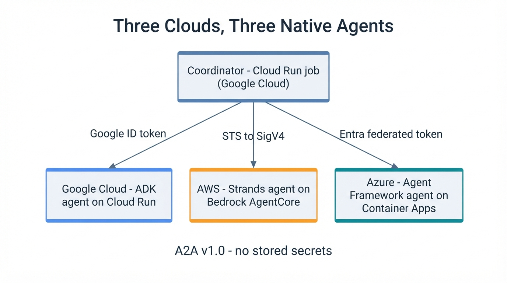

# Three Clouds, Three Native Agents



## What is this project trying to do?

Three AI agents, each built with a different vendor's framework, each running on
that vendor's own hosting, all answering the same question at the same time:

- **Google** — an ADK agent on Cloud Run
- **AWS** — a Strands agent on Bedrock AgentCore Runtime
- **Azure** — an Agent Framework agent on Container Apps

One coordinator calls all three over **A2A v1.0** and takes the median of their
answers. And there is **no long-lived credential stored anywhere in the running
system** — every call is authenticated with a token minted at the moment it is
needed.

Everything is here:
[github.com/xbill9/multicloud-adk-a2a-currency](https://github.com/xbill9/multicloud-adk-a2a-currency).
You can run the whole mesh on a laptop in about a minute; instructions are below.

The surprise wasn't the protocol. A2A worked. The surprise was that almost every
decision that mattered was made *before* a single A2A call happened.

## Why bother? Just use a key

You have an agent on one cloud. Someone asks you to have it call an agent on
another.

The reflex is to create a service account key, drop it in a secret manager, and
move on. That works. It also means you now own a credential forever — rotating
it, scoping it, auditing it, and eventually explaining to somebody why
production contains a static key.

There is another way, and the interesting part is that it isn't harder. It is
just decided earlier.

## The one decision that sets everything else

Here is the asymmetry the whole design falls out of.

**Every agent you want to call can consume an external token.** AWS IAM has OIDC
identity providers. Entra has Federated Identity Credentials. AgentCore accepts a
`CUSTOM_JWT`. All three will trust a token minted somewhere else, provided you
set the trust up correctly.

**But only some runtimes can mint one.** A runtime that can produce a workload
OIDC token — for an audience *you* choose — can federate outward to any of them.
A runtime that cannot is back to storing a credential.

So "where does my coordinator run?" is really "how many secrets will this system
have?"

| Coordinator host | Legs it makes | Long-lived secrets |
| :--- | :--- | :--- |
| **Cloud Run** | GCP→AWS, GCP→Azure, GCP→GCP | potentially **zero** |
| AgentCore | AWS→Azure, AWS→GCP | at least one |
| Foundry | Azure→AWS, Azure→GCP | one or two, both unproven |

Cloud Run wins here because its metadata server hands you an ID token for any
audience you name, which is exactly what the other two clouds' trust policies
want to see. Whether AgentCore can do the same is unconfirmed — I did not test
it. So "zero secrets" is a property of *this* topology, not a law about
cross-cloud agents.

Two things that choice costs you, worth saying out loud:

**One leg stops being cross-cloud.** The coordinator runs on Cloud Run, so the
GCP leg is Google calling Google. Two vendor boundaries get crossed, not three.
That belongs in the results, not in a footnote.

**You cannot run it locally.** A user credential cannot mint an
arbitrary-audience ID token at all — `gcloud auth print-identity-token
--audiences=...` refuses outright, telling you it requires a service account.
There is no laptop version of this path. Once you choose federation, the only
place the system works is the place it is deployed.

## Three legs, three mechanisms, one seam

The legs do not look alike:

- **GCP → GCP** — an ID token whose audience is the target service's URL, plus
  `roles/run.invoker`.
- **GCP → AWS** — mint that token, hand it to STS `AssumeRoleWithWebIdentity`,
  get temporary credentials back, sign the request with SigV4.
- **GCP → Azure** — mint that token, present it to Entra as a client assertion
  against a Federated Identity Credential, get an access token back.

Two bearer tokens and a request signature. Different shapes entirely.

The move that made the rest tractable was putting all three behind one interface:
`httpx.Auth`. To httpx, a bearer header and a signature over the request body are
the same kind of object. All three vendor SDKs accept an `httpx.AsyncClient`. So
the credential attaches once, and everything through that client carries it.

```python
auth = credentials_for(peer, endpoint)   # an httpx.Auth, or None
client = load_client(stack, endpoint, auth=auth)
```

Build that seam **before** your second cloud, not after your third. Get one leg
working with inline code and promise to generalise later, and you end up with
three error-handling styles and three places a token gets cached.

> **Worth noticing:** an agent's card lives at `/.well-known/agent-card.json`,
> and it sits behind the same authorization as the agent itself. Attach your
> credential to the *request* instead of the *client* and discovery 403s while
> the actual call would have worked. You get a protocol error pointing nowhere
> near auth. Attaching to the client makes that impossible by construction.

## Five traps that look exactly like working configuration

None of these are typos. Each is something you can get wrong while being careful.

**Audience is not authorization.** The *caller* picks the audience. So a trust
policy checking only audience proves that *somebody* in that IdP minted a token —
not that *your* identity did. Pin the subject too, and pin it to the immutable
numeric ID rather than the email, because emails can be released and re-bound to
someone else.

**AWS and Azure invert the same step.** AWS federates with `accounts.google.com`
natively — create an explicit IAM OIDC provider for it and you *break* it with
`InvalidIdentityToken`. Entra requires you to create the credential explicitly.
Same conceptual task, opposite prerequisites, and neither error tells you which
rule you are on.

**The IAM condition keys do not hold what their names say.**
`accounts.google.com:oaud` is the token's `aud`. `accounts.google.com:aud` is its
`azp`, which is a number. Put an audience string in `:aud` and you have written a
condition that can never match. The denial will not mention it.

**Ask for the whole token.** The GCP metadata mint takes `format=full`. Without
it, Google trims claims — including `email` — and any trust condition reading
that claim silently stops matching.

**Two error codes are worth more than a day of logging.** From STS,
`InvalidIdentityToken` means the token did not validate at all, which is a
provider-setup problem. `AccessDenied` means it validated fine and your
conditions did not match, which is a policy problem. Different afternoons.

Which leads to the one habit I would carry to any project like this: **log the
raw provider response at every auth boundary.** In an agent system an error comes
back as a tool result, and a model in the middle will cheerfully paraphrase
`AccessDenied: condition accounts.google.com:sub did not match` into "there was
an issue with the credentials." A raised message is not an observable.

## Running it

Start local. Three agents on loopback, no cloud account, about a minute:

```bash
git clone https://github.com/xbill9/multicloud-adk-a2a-currency
cd multicloud-adk-a2a-currency

uv pip install --system "a2a-sdk[http-server]" google-adk \
  agent-framework-a2a agent-framework-core \
  pydantic httpx uvicorn pytest pytest-asyncio
uv pip install --system -e .
```

Bring up the three agents and ask them a question:

```bash
./infra/run_mesh.sh start          # :10001 :10002 :10003
python3 -m coordinator.cli 100 USD EUR JPY
```

Three vendors' agent stacks answering together:

```
participants: gcp, aws, azure

100 USD = 92 EUR @ 0.92 [3/3 clouds, agreed]
    gcp                  92 (164ms)
    aws                  92 (25ms)
    azure                92 (12ms)
```

The demo is the more interesting run, because it shows what happens when a
participant is *wrong*:

```bash
./infra/demo.sh
```

Four acts: three clouds answering, the 3×3 interop matrix, a cloud going
offline, and a cloud lying. The last two are the point — anything can show three
green ticks.

Deploying for real is one script per cloud, then one command to wire them
together:

```bash
./infra/deploy_aws.sh   deploy     # AgentCore Runtime + federated role
./infra/deploy_azure.sh deploy     # Container App
./infra/deploy_azure.sh fic        # Entra app registration + federated credential
./infra/deploy_azure.sh auth       # make the ingress actually demand it

./infra/deploy_gcp.sh deploy       # ADK service + coordinator job
./infra/deploy_gcp.sh wire         # fold the AWS and Azure legs in
./infra/deploy_gcp.sh run          # three-cloud consensus, from the cloud
./infra/deploy_gcp.sh verify       # the negative controls
```

> **Run `verify` twice.** It is the part that decides whether any of the auth
> claims mean anything, for a reason covered below.

## Deployment decisions that aged well

**Put deployment in the repo as verbs, not in a runbook.** `deploy`, `wire`,
`verify`. Each cloud's identifiers live in exactly one place — the script that
created them — and the other scripts read them back rather than keeping copies.

I can tell you precisely what that buys, because I tore the entire mesh down and
rebuilt it from nothing to check.

The AWS runtime came back with a **different ARN**, and its invocation URL
contains that ARN. The Entra app registration came back with a **different client
ID**. The Container App came back on a **different FQDN**. Nothing was edited by
hand. `wire` read all three back out and the mesh returned:

```
100 USD = 92 EUR @ 0.92 [3/3 clouds, agreed]
```

Any copy of any of those identifiers stored anywhere else would have been stale
the moment it was written down.

Then the whole verification pass ran again against infrastructure that had not
existed an hour earlier: three consensus runs at `3/3 clouds, agreed`, and all
eight auth probes — each leg answering with its credential, each leg denied
without it, an unauthenticated request rejected, and a right-identity
wrong-audience request rejected. Every number in this article comes from that
rebuilt mesh.

That teardown also found two bugs that no amount of redeploying would have,
because they live on code paths you can only reach from nothing:

- A retry wrapper I had added to the AWS script made "no runtime exists" return
  an error instead of the string `None`. Under `set -e`, a *first* deploy died
  silently before ever creating the runtime. Every deploy since I wrote it had
  taken the update branch, so nothing ran the broken path.
- Azure **soft-deletes** Cognitive Services accounts. Deleting the resource group
  does not purge them, so recreating by the same name fails with
  `FlagMustBeSetForRestore` — an error that never mentions deletion. `destroy`
  followed by `deploy` could not rebuild the Foundry account.

> **If you take one operational thing from this article:** rebuild from nothing
> at least once before you tell anyone it is reproducible.

**Scale to zero, and label what it costs.** Everything here idles at zero
replicas. Paying for idle capacity on three clouds to make a latency table look
tidier is paying to mislead. But it means the first call into a leg pays a cold
start — a cold Azure leg measured **27.8 seconds** against **0.5 seconds** warm.
Mix those two regimes in one table and every conclusion drawn from it is wrong.

## Scaffolding worth stealing

Four structures did most of the work.

| Structure | What it buys |
| :--- | :--- |
| One credential seam (`httpx.Auth`) | callers never know which of three mechanisms they are using |
| One participant interface (`convert()`) | a cloud is an implementation, not a branch |
| An instrument, not a demo | every failure typed by layer, not just red |
| Controls scoped to one leg | a degrading system cannot hide a denial from you |

That last one is the one I would most want you to copy, because getting it wrong
is invisible.

The mesh takes a median across three clouds and degrades on purpose. Lose a
cloud, the other two still reach quorum, and the run exits **0**. Now try testing
your auth by removing one leg's credential from a three-cloud run. It still exits
0. That reads as "no denial happened." What actually happened is "the denial was
absorbed."

So every leg gets probed alone. Eight probes: each leg answering with its
credential, each leg denied without it, an unauthenticated request rejected, and
a right-identity-wrong-audience request rejected. Only then does an exit code
mean anything.

The general form: **any system with graceful degradation needs its controls
scoped to a single component, or the degradation hides exactly the failure you
are testing for.**

## What it costs

Warm runs of the three-cloud consensus, after the rebuild:

| | GCP (in-cloud) | AWS | Azure | elapsed |
| :--- | :--- | :--- | :--- | :--- |
| range | 836–948ms | 1027–1109ms | 468–512ms | 1711–1854ms |

Elapsed lands roughly a second above the *slowest single leg*, and far below the
sum of all three. The legs are issued concurrently, so the sum was never the
right model — but neither is the slowest leg on its own. That extra second is the
coordinator's own fixed cost: container start, three agent-card fetches, three
credential mints.

> **Worth noticing:** an earlier version of this claim quoted the slowest leg
> alone and was **wrong by 85%** on the fastest run. That error only became
> visible once there was more than one sample.

The federation itself is cheap. Token mints and exchanges are a small slice of
that fixed second. If the mesh feels slow, it is a cold start or a model — not
the identity work.

## What this does not show

One deployment, one account, one region pair, one person, over a few days. These
are existence proofs: a thing worked, in a configuration. They are not
measurements of a population.

It is keyless in operation, not in bootstrap. Creating trust policies, app
registrations and federated credentials used ordinary operator credentials, as
provisioning always does.

And that claim needed checking, which is the honest part. The three A2A legs were
always keyless — but the Azure app pulled its container image using the
registry's admin password, stored as a secret in its own configuration. Not on
any agent-to-agent path, and still enough to make "no stored secrets" false as
written. Container Apps supports pulling by managed identity, so the fix was a
role grant and deleting the secret. An audit of all three deployments now shows
no stored credential in any of them.

The dull general point: **image pull is part of your deployed system.** A claim
about secrets has to cover all of it, not just the interesting part.

Token expiry and refresh are implemented and tested against a frozen clock, but
no token has ever expired in production — every run is a job that lives a few
seconds.

## If you are starting one of these

Decide where the coordinator runs before anything else; it sets the secret count
for the entire system. Build the credential seam before the second cloud. Attach
auth to the client, not the request, so discovery is covered. Log the provider's
own words at every boundary, because you will spend more time reading auth
failures than writing auth code. Scope your controls to one component, because a
system built to survive failure will happily hide one from you.

And rebuild it from nothing once, before you claim it is reproducible.

---

**Repo:**
[github.com/xbill9/multicloud-adk-a2a-currency](https://github.com/xbill9/multicloud-adk-a2a-currency)
— the three agents, the coordinator, the interop matrix, the deploy scripts, and
the findings write-ups in `docs/`.
